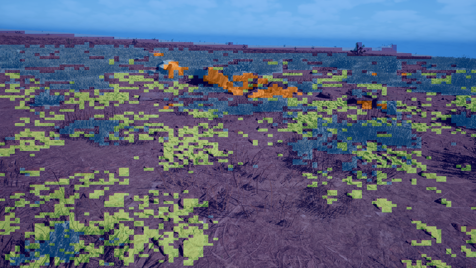

# Offroad Semantic Scene Segmentation using SegFormer

Transformer-based terrain understanding for autonomous off-road vehicles.

---

## Project Overview

This project focuses on building a **semantic segmentation model** capable of understanding complex off-road terrain environments. The system was developed as part of the **Duality AI Offroad Autonomy Segmentation Challenge**.

The model performs **pixel-level classification**, meaning each pixel in an input image is assigned a terrain class such as vegetation, rocks, ground clutter, or sky.

The goal is to demonstrate how **deep learning perception systems** can help autonomous vehicles better understand off-road environments.

---

## Dataset

The dataset used in this project was generated using **Duality AI's Falcon Digital Twin simulation platform**.

It contains synthetic desert environments with annotated segmentation masks.

### Terrain Classes

| ID | Class Name |
|----|------------|
| 100 | Trees |
| 200 | Lush Bushes |
| 300 | Dry Grass |
| 500 | Dry Bushes |
| 550 | Ground Clutter |
| 600 | Flowers |
| 700 | Logs |
| 800 | Rocks |
| 7100 | Landscape |
| 10000 | Sky |

---

```## Project Structure
offroad-segformer/
│
├── dataset/
│ ├── Offroad_Segmentation_Training_Dataset
│ └── Offroad_Segmentation_testImages
│
├── predictions/
├── overlay_results/
├── models/
│
├── train_segformer.py
├── dataset.py
├── predict.py
├── visualize_predictions.py
├── make_overlay_video.py
├── make_drone_hud_video.py
│
├── training_graphs.png
├── README.md
└── requirements.txt
```


---

## Model Architecture

The model used in this project is **SegFormer**, a transformer-based semantic segmentation architecture.

### Key Components

• Hierarchical Transformer Encoder  
• Multi-scale Feature Extraction  
• Lightweight Segmentation Decoder  
• Pixel-wise Terrain Classification

The model outputs a **segmentation map** where each pixel corresponds to a terrain class.

---

## Training

The model was trained using **PyTorch**.

### Training Configuration

| Parameter | Value |
|----------|-------|
| Architecture | SegFormer |
| Optimizer | AdamW |
| Loss Function | Cross Entropy |
| Input Resolution | 450x450 |
| Epochs | 25+ |
| Device | GPU |

### Training Command
python train_segformer.py
Evaluation Metrics
Model performance was evaluated using:
Mean Intersection over Union (mIoU)
Training Loss
Pixel Accuracy
Final Model Performance:
Mean IoU ≈ 0.65

## Results

Example segmentation output : 


Input Image	Segmentation Map	Overlay
RGB Terrain	Pixel Labels	Combined Visualization
Training performance graphs:

Loss vs Epoch
IoU vs Epoch

## The system produces : 

Segmentation overlays

Terrain understanding visualization

Simulation video showing frame-by-frame segmentation

Challenges & Improvements

Challenges encountered during development included:

Handling corrupted dataset images

Managing GPU memory during training

Label mapping for segmentation masks

Solutions included dataset filtering, batch size tuning, and preprocessing improvements.

Future Work

Possible improvements include:

Real-time deployment on autonomous vehicles

Larger datasets for better generalization

Integration with path planning algorithms

Multi-sensor perception systems

Authors

Team Name: AlgoForge
